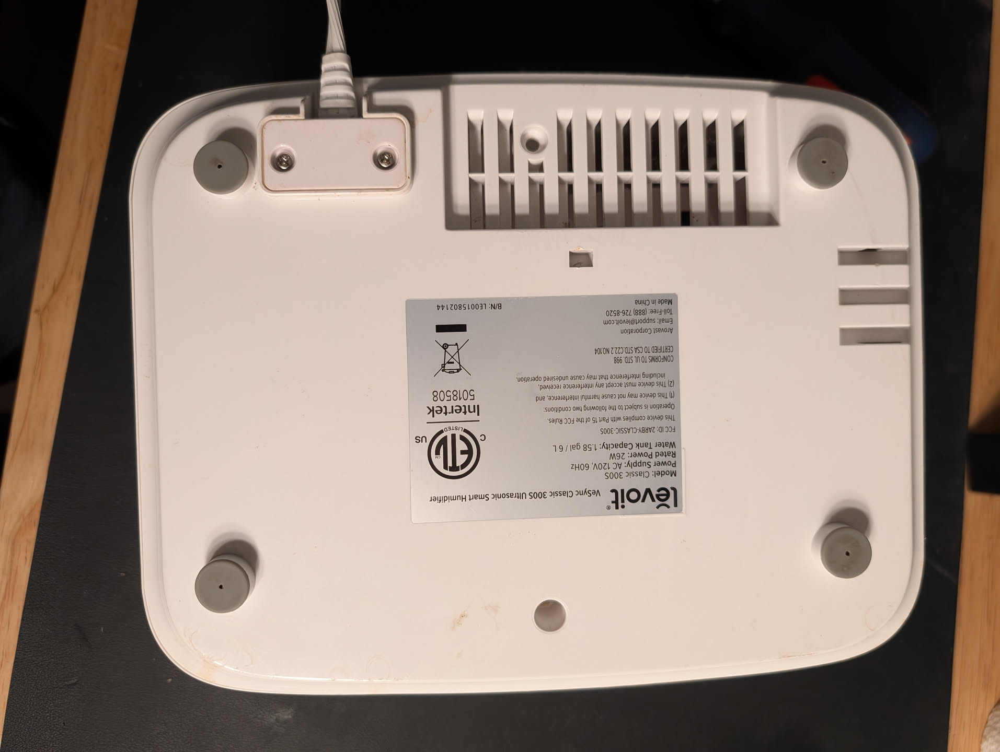
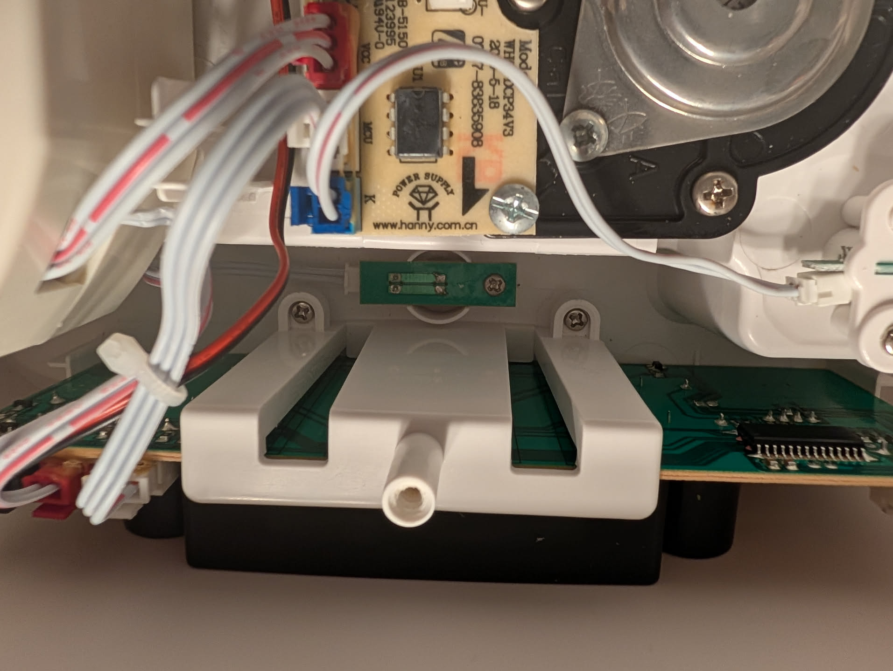
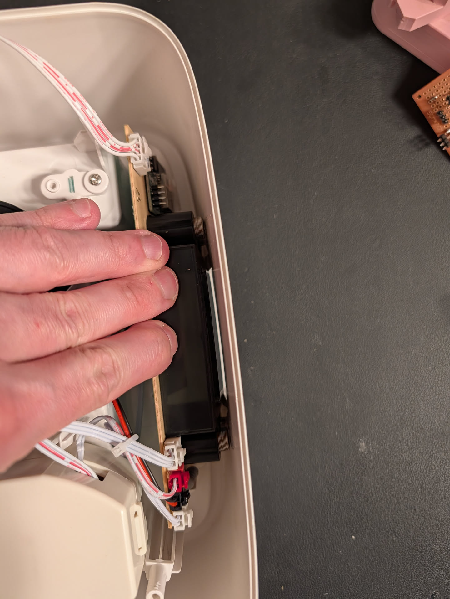
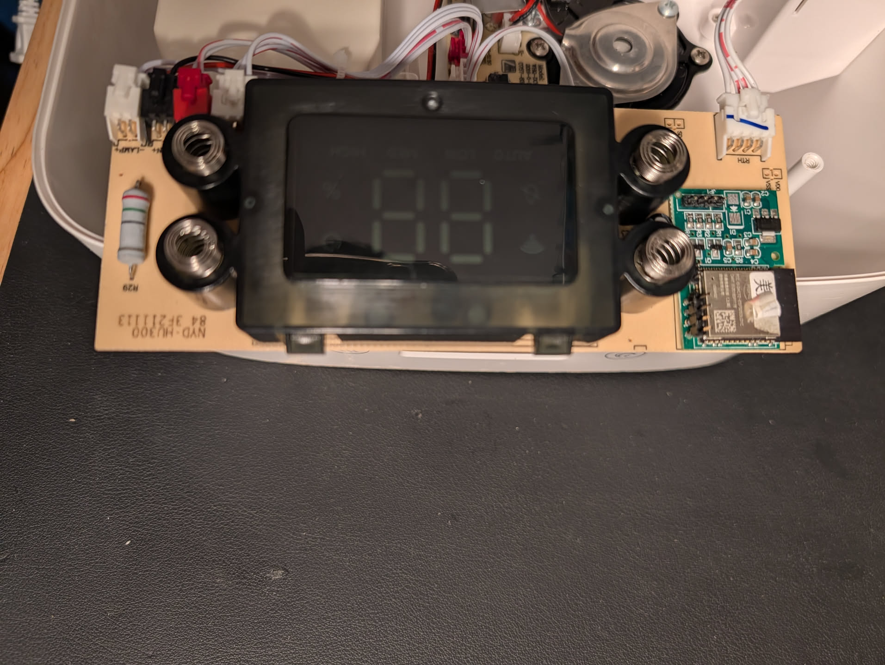
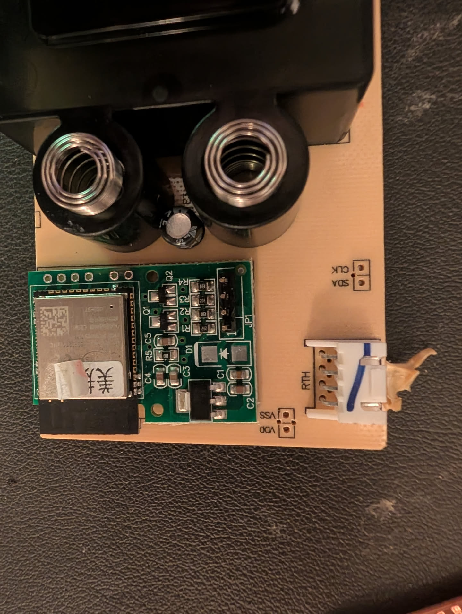

# ESPHome Levoit Classic 300S Humidifier

Local, cloud-free control of the Levoit VeSync Classic 300S humidifier by replacing the stock ESP32 firmware with ESPHome. The ESP32 continues to use the appliance's original main MCU for the control panel, sensors, safety interlocks, and mist hardware.

This project is based on UART captures from a Classic 300S and follows the external-component layout used by [acvigue/esphome-levoit-air-purifier](https://github.com/acvigue/esphome-levoit-air-purifier).

> [!WARNING]
> This project requires opening a mains-powered appliance and replacing its firmware. Disconnect mains power before opening it. Do not probe or operate exposed mains circuitry. Back up the stock ESP32 flash before erasing it. You assume the risk of electric shock, fire, equipment damage, and loss of the original cloud firmware.

## What works

| Function | Home Assistant entity | Status |
|---|---|---|
| Power and mist level 1–9 | Fan | Implemented; levels 1, 2, 4, and 9 observed directly |
| Manual/auto mode | Select | Implemented; unmapped MCU values report `Unknown` |
| Auto target humidity, 30–80% | Number | Implemented; arbitrary targets observed |
| Current humidity | Sensor | Implemented |
| Temperature | Sensor | Implemented; byte is believed to be °C |
| Night light off/50%/100% | Light | Implemented; other brightness values are quantized |
| Tank lifted/interlock open | Problem binary sensor | Implemented |
| MCU communication loss | Optional problem binary sensor + component warning | Implemented |
| Raw 17-byte MCU state | Diagnostic text sensor | Implemented |
| Out-of-water warning | — | Not mapped yet |
| Sleep mode/display control | — | Not mapped yet |
| Timers and schedules | Home Assistant automations | Intentionally handled in Home Assistant |

ESPHome currently has no native entity that exports as Home Assistant's `humidifier` domain, so the device is represented with standard ESPHome fan, select, number, light, sensor, and binary-sensor entities.

## Hardware and UART

The stock Wi-Fi module is an ESP32-SOLO-1 / ESP32-S0WD with 4 MB flash. The appliance UART uses 9600 baud, 8 data bits, no parity, and 1 stop bit.

| ESP32 pin | Direction | Purpose |
|---|---|---|
| GPIO17 | ESP32 → MCU | Commands |
| GPIO16 | MCU → ESP32 | Responses and status |
| GPIO1 / GPIO3 | — | UART0, retained for flashing/recovery |

The FP1 connector and captured protocol are documented in [levoit_humidifier_uart_protocol_notes.md](levoit_humidifier_uart_protocol_notes.md). The appliance board must retain its original level shifting; do not connect a 5 V UART signal directly to an ESP32 GPIO.

## Disassembly

Unplug the humidifier and remove the water tank before starting. Keep the mains cord unplugged for the entire disassembly, backup, and flashing process. The photos show one hardware revision; stop if your unit differs materially instead of assuming that its wiring or header pinout is identical.

1. Turn the humidifier upside down. Remove all four rubber feet to expose one screw beneath each foot, then remove those four screws and the two visible screws beside the power-cord bracket (six bottom screws total).

   

2. Lift the bottom shell carefully without pulling on the internal wiring. Remove the two screws securing the white plastic bracket around the control/display (MCU) assembly.

   

3. The assembly in the photographed unit was not glued. Gently push the black display back and inward while moving the white plastic bracket forward. Once the display clears the plastic case, the assembly should come out freely. Do not pry against the PCB or pull it by its wires.

   

4. Turn the freed control/display assembly over to expose the ESP32 daughterboard at its edge. Support the assembly so that its connectors and wires are not strained.

   

5. Locate the six unpopulated serial-header holes on the ESP32 daughterboard. With the board oriented exactly as in the close-up below, they are, from left to right: **IO0, RxD0, TxD0, EN, GROUND, 3.3V**.

   

## Back up and flash with a CP2102

A CP2102 or equivalent USB-to-TTL serial adapter must use **3.3 V logic**. Never connect 5 V to the header, and never power the open appliance from mains while the USB adapter is connected.

The ESP32 needs a stable 3.3 V supply with enough capacity for its current bursts. Many CP2102 boards expose a 3.3 V pin that is intended only as a small regulator output and cannot reliably power an ESP32 or the attached control board. Use that pin only if the adapter manufacturer explicitly rates it for the load; otherwise use a separate regulated 3.3 V supply and join its ground to the adapter ground. Do not connect two power sources at once.

### Wiring

The `RxD0` and `TxD0` names below are from the ESP32's perspective, so the serial data wires cross:

| ESP32 header | CP2102 / supply | Use |
|---|---|---|
| IO0 | GROUND, temporarily | Hold low while resetting to enter the ROM bootloader |
| RxD0 | TXD | Data from the adapter to the ESP32 |
| TxD0 | RXD | Data from the ESP32 to the adapter |
| EN | GROUND, momentarily | Reset; release after a brief pulse |
| GROUND | GND | Common ground |
| 3.3V | Regulated 3.3 V | Board power; never connect 5 V |

Soldering a temporary 0.1-inch header gives the most reliable connection. If using test hooks or pogo pins, secure them before applying power and check for shorts with a meter. Leave IO0 and EN disconnected from ground during normal operation.

### Enter the ESP32 ROM bootloader

1. Disconnect 3.3 V power.
2. Connect IO0 to GROUND.
3. Apply 3.3 V power.
4. Briefly connect EN to GROUND, then release EN.
5. Release IO0 from GROUND. The ESP32 remains in its serial bootloader until the next reset.

Repeat this sequence before a command if the serial tool cannot connect. A basic CP2102 adapter normally does not drive EN and IO0 automatically, so messages such as `Connecting...` usually mean that the manual bootloader sequence was missed or the TX/RX wires need checking.

### Back up the stock 4 MB flash

Install [esptool](https://docs.espressif.com/projects/esptool/en/latest/esp32/installation.html), identify the serial port, and enter the ROM bootloader. The examples use Linux's usual `/dev/ttyUSB0`; substitute the actual port on your system.

```bash
python3 -m pip install --user esptool
PORT=/dev/ttyUSB0
python3 -m esptool --chip esp32 --port "$PORT" flash-id
```

The `flash-id` result should identify an ESP32 and a 4 MB flash device before you continue. Read the entire flash twice and compare the files so that a flaky wire does not become your only backup:

```bash
PORT=/dev/ttyUSB0
python3 -m esptool --chip esp32 --port "$PORT" read-flash 0x000000 0x400000 classic300s-stock-a.bin
python3 -m esptool --chip esp32 --port "$PORT" read-flash 0x000000 0x400000 classic300s-stock-b.bin
sha256sum classic300s-stock-a.bin classic300s-stock-b.bin
cmp classic300s-stock-a.bin classic300s-stock-b.bin
```

`cmp` should produce no output and exit successfully, and the two SHA-256 values should match. Keep at least one copy somewhere outside this repository. The image can contain device identifiers and Wi-Fi or cloud credentials, so do not publish or commit it. Some factory firmware enables ESP32 security features that can restrict ROM bootloader reads or writes; do not erase anything unless the complete 4 MB read succeeds and verifies.

### Compile and flash ESPHome

Copy `secrets.example.yaml` to `secrets.yaml`, replace every placeholder, then validate and compile the supplied configuration:

```bash
cp secrets.example.yaml secrets.yaml
esphome config levoit-vesync-classic-300s-humidifier.yaml
esphome compile levoit-vesync-classic-300s-humidifier.yaml
```

Enter the ROM bootloader again and upload over the serial port:

```bash
PORT=/dev/ttyUSB0
esphome upload levoit-vesync-classic-300s-humidifier.yaml --device "$PORT" --upload-speed 115200
```

After the upload completes, disconnect 3.3 V power, remove the IO0-to-ground connection, and power the board again. Runtime logging is available over the ESPHome API because this configuration deliberately disables UART0 logging.

Keep the appliance open only as long as needed to confirm Wi-Fi, API connectivity, UART status frames, and control. Disconnect all low-voltage power and the serial adapter before reassembly. Refit the display/control assembly without pinching wires, reinstall its two bracket screws, close the bottom, reinstall all six bottom screws, and replace the four rubber feet before reconnecting mains.

### Restore the stock backup

To return to the exact captured flash contents, enter the ROM bootloader and write the verified full-flash image at offset zero:

```bash
PORT=/dev/ttyUSB0
python3 -m esptool --chip esp32 --port "$PORT" write-flash 0x000000 classic300s-stock-a.bin
python3 -m esptool --chip esp32 --port "$PORT" verify-flash 0x000000 classic300s-stock-a.bin
```

Disconnect power, make sure IO0 is no longer grounded, and power-cycle the board. Restoration depends on the ESP32's security settings still permitting serial writes, which is another reason to make and verify the backup before the first ESPHome upload.

## External component source

Repository-local validation and compilation use the checked-out component:

```yaml
external_components:
  - source:
      type: local
      path: components
    components: [levoit_classic_300s]
```

Configurations in another repository should pin a published release tag or immutable commit. Replace the placeholder only with a ref that exists in this repository; do not follow the moving `main` branch for an appliance controller:

```yaml
external_components:
  - source: github://MikeG3D2/esphome-levoit-humidifier@<release-tag-or-commit>
    components: [levoit_classic_300s]
```

This repository does not yet have a release tag for these fixes. Creating and publishing one is a separate release action.

## Configuration

```yaml
uart:
  id: humidifier_uart
  tx_pin: GPIO17
  rx_pin: GPIO16
  baud_rate: 9600

levoit_classic_300s:
  uart_id: humidifier_uart
  update_interval: 30s
  command_interval: 100ms
  status_response_timeout: 5s
  humidifier:
    name: Humidifier
  mode:
    name: Mode
  target_humidity:
    name: Target humidity
  night_light:
    name: Night light
    gamma_correct: 1.0
    default_transition_length: 0s
  current_humidity:
    name: Current humidity
  temperature:
    name: Temperature
  tank_lifted:
    name: Tank lifted
  communication_problem:
    name: MCU communication problem
  raw_status:
    name: Raw MCU status
```

`command_interval` spaces frames sent to the main MCU. After a control command, the module automatically requests authoritative status instead of assuming that the MCU accepted the requested state. Duplicate pending status requests are coalesced.

`status_response_timeout` starts when a status request is actually transmitted and defaults to 5 seconds. This is deliberately much longer than the roughly 40 ms needed to transmit a request and full status frame at 9600 baud, while remaining well below the default 30-second polling interval. A timeout raises the component warning state and, when configured, `communication_problem`; the next valid status clears both. Last-known entity values remain published because ESPHome 2026.7.1 does not provide a common safe unavailable-state operation across fan, select, number, light, and sensor entities.

### Capturing unmapped states

The `raw_status` diagnostic entity exposes status bytes D0-D16. For a controlled capture, temporarily compile complete frame logging for only this component:

```yaml
logger:
  level: VERY_VERBOSE
  initial_level: DEBUG
  baud_rate: 0
  logs:
    levoit_classic_300s: VERY_VERBOSE
```

View the logs through the ESPHome Device Builder or `esphome logs`. The component records every valid transmitted and received frame, while `baud_rate: 0` keeps UART0 quiet for flashing and recovery. `VERY_VERBOSE` logging can affect performance and API stability, so restore the normal `DEBUG` logger after collecting captures.

Change one physical state at a time and save the complete before/after frames. An unrecognized operating-mode byte is reported as `Unknown` instead of being guessed as Auto; its exact value remains visible in `raw_status` and the frame log.

## Protocol design

The public ESPHome interface is deliberately separated from the wire protocol:

```text
Home Assistant entities
          │
          ▼
  LevoitClassic300S
  command queue + state publication
          │
          ▼
 streaming frame parser / encoder
          │
          ▼
  9600-baud appliance UART
```

Frames begin with `A5`, include a two-byte little-endian payload length, and satisfy `sum(all frame bytes) & 0xFF == 0xFF`. The streaming parser ignores noise, accepts fragmented input, bounds buffered data to the 64-byte maximum payload plus six framing bytes, checks checksums, and recovers by retaining the next possible preamble after malformed or truncated input. A valid frame already buffered behind a malformed candidate is emitted immediately.

Command normalization is policy, separate from captured wire facts: auto humidity clamps to 30–80%, manual mist clamps to levels 1–9, and night-light brightness quantizes to off/50%/100%. The C++ production layer and Python reverse-engineering scaffold share those rules. Status bytes are never normalized: invalid targets and unknown modes remain unchanged in `raw_status` and logs, while invalid targets are withheld from the Number entity and cannot replace the last valid auto target.

## Tests

The protocol layer has no ESPHome dependency and can be tested on the host:

```bash
bash tests/run_cpp_tests.sh
bash tests/run_cpp_sanitizers.sh
PYTEST_DISABLE_PLUGIN_AUTOLOAD=1 pytest -q
esphome config levoit-classic-300s-ci.yaml
esphome compile levoit-classic-300s-ci.yaml
```

The C++ tests cover captured frame reproduction, every command builder, incremental parsing, malformed-stream recovery, bounded buffering, status decoding, and communication-health behavior. The Python reverse-engineering scaffold has matching normalization and regression tests. CI pins ESPHome 2026.7.1 and compiles the checked-out local component without secrets.

## Reverse-engineering next steps

The remaining work requires controlled captures, not guesses:

1. Record several full status frames with the tank seated and filled.
2. Trigger the out-of-water warning with the tank still seated.
3. Diff only status bytes D0–D16 and repeat to confirm the candidate bit.
4. Capture entering and leaving Sleep mode and display-off independently.
5. Add fixtures to the tests before assigning names or entities to those fields.

Please include raw frames, the exact physical state, firmware/model label, and one-variable-at-a-time capture steps with protocol contributions.
